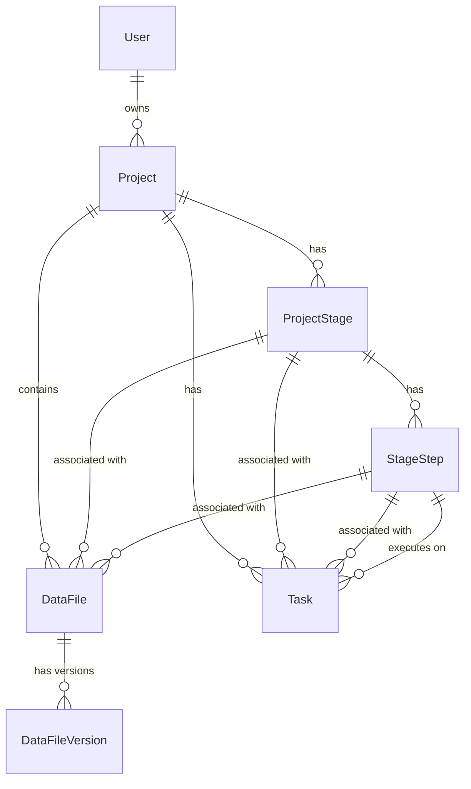

# 数据提取平台 - 数据库重构设计方案（精简版）

> **设计目标**：打造清晰、可维护、支持版本控制的科研文献筛选平台
> 
> **版本**：v2.0  
> **日期**：2026-04-18  
> **适用场景**：个人科研项目管理

---

## 一、核心设计原则

### 1. 单用户架构
- 每个用户独立管理自己的项目
- 无需复杂的权限管理
- 简化团队协作功能

### 2. 适度扩展性
- 工作流固定（6 大阶段），但步骤可跳过
- 步骤状态独立建模，便于追踪
- 文件按阶段/步骤组织，结构清晰

### 3. 数据可追溯
- 文件版本控制：关键文件记录变更历史
- 任务日志：完整记录处理过程
- 元数据管理：灵活存储配置和结果

---

## 二、核心实体设计（精简版）

### 2.1 用户与权限（完整权限管理系统）

```python
# 用户表（复用 Django auth_user）
User
  - id
  - username
  - email
  - date_joined

# 用户配置文件
UserProfile
  - user: FK(User, OneToOne)
  - role: VARCHAR(20)                  # admin/researcher/viewer（基础角色）
  - quota_projects: INT                # 项目配额（-1 为无限）
  - quota_storage_mb: INT              # 存储配额（MB）
  - is_approved: BOOL                  # 是否已审核通过
  - approved_at: DATETIME
  - approved_by: FK(User, nullable)
  - created_at: DATETIME
  - updated_at: DATETIME

# 权限表（系统预定义）
Permission
  - id
  - code: VARCHAR(100)                 # 权限代码（如 project.create）
  - name: VARCHAR(255)                 # 权限名称
  - category: VARCHAR(50)              # 权限分类（user/project/system）
  - description: TEXT                  # 权限描述
  - is_system: BOOL                    # 是否系统权限（不可删除）
  - created_at: DATETIME
  
  UNIQUE(code)

# 用户权限关系表
UserPermission
  - id
  - user: FK(User)
  - permission: FK(Permission)
  - granted_by: FK(User)               # 授权人
  - granted_at: DATETIME
  - expires_at: DATETIME(nullable)     # 权限过期时间（可选）
  
  UNIQUE(user, permission)

# 角色权限模板表（可选，便于批量授权）
RoleTemplate
  - id
  - name: VARCHAR(100)                 # 模板名称（如"标准研究者"）
  - description: TEXT
  - is_system: BOOL                    # 是否系统预设
  - created_at: DATETIME

# 角色-权限关联表
RoleTemplatePermission
  - id
  - role_template: FK(RoleTemplate)
  - permission: FK(Permission)
```

---

### 权限体系设计

#### 1. 系统预定义权限

| 分类 | 权限代码 | 权限名称 | 说明 |
|------|---------|---------|------|
| **用户管理** | user.view_all | 查看所有用户 | 管理员权限 |
| | user.create | 创建用户 | 管理员权限 |
| | user.approve | 审核用户 | 管理员权限 |
| | user.edit_quota | 修改用户配额 | 管理员权限 |
| | user.grant_permission | 授予权限 | 管理员权限 |
| | user.revoke_permission | 撤销权限 | 管理员权限 |
| **项目管理** | project.create | 创建项目 | 普通用户 |
| | project.view_own | 查看自己的项目 | 普通用户 |
| | project.view_all | 查看所有项目 | 管理员权限 |
| | project.edit_own | 编辑自己的项目 | 普通用户 |
| | project.delete_own | 删除自己的项目 | 普通用户 |
| | project.export | 导出项目数据 | 普通用户 |
| **阶段管理** | stage.skip | 跳过阶段/步骤 | 普通用户 |
| | stage.reset | 重置阶段状态 | 高级权限 |
| **任务执行** | task.start | 启动任务 | 普通用户 |
| | task.stop | 停止任务 | 普通用户 |
| | task.view_logs | 查看任务日志 | 普通用户 |
| **文件管理** | file.upload | 上传文件 | 普通用户 |
| | file.download | 下载文件 | 普通用户 |
| | file.delete | 删除文件 | 普通用户 |
| | file.view_versions | 查看文件版本 | 普通用户 |
| **系统管理** | system.view_stats | 查看系统统计 | 管理员权限 |
| | system.config | 系统配置 | 超级管理员 |

---

#### 2. 角色权限模板（预设）

**超级管理员（Super Admin）**：
- 拥有所有权限
- 系统初始化时创建，不可删除

**管理员（Admin）**：
- 用户管理：user.* 全部权限
- 项目管理：project.view_all
- 系统管理：system.view_stats

**标准研究者（Researcher）**：
- 项目管理：project.create, project.view_own, project.edit_own, project.delete_own, project.export
- 阶段管理：stage.skip
- 任务管理：task.*
- 文件管理：file.*

**访客（Viewer）**：
- 仅只读权限（未来扩展）

---

#### 3. 权限检查机制

**API 层权限装饰器**：
```python
from functools import wraps
from rest_framework.exceptions import PermissionDenied

def require_permission(permission_code):
    """权限检查装饰器"""
    def decorator(func):
        @wraps(func)
        def wrapper(self, request, *args, **kwargs):
            user = request.user
            
            # 超级管理员跳过检查
            if user.is_superuser:
                return func(self, request, *args, **kwargs)
            
            # 检查用户是否拥有该权限
            has_perm = UserPermission.objects.filter(
                user=user,
                permission__code=permission_code,
                expires_at__isnull=True  # 或未过期
            ).exists() or UserPermission.objects.filter(
                user=user,
                permission__code=permission_code,
                expires_at__gt=timezone.now()
            ).exists()
            
            if not has_perm:
                raise PermissionDenied(f"缺少权限：{permission_code}")
            
            return func(self, request, *args, **kwargs)
        return wrapper
    return decorator

# 使用示例
class ProjectViewSet(viewsets.ModelViewSet):
    @require_permission('project.create')
    def perform_create(self, serializer):
        # ...
        
    @require_permission('project.view_all')
    @action(detail=False, methods=['get'])
    def all_projects(self, request):
        # 管理员查看所有项目
        return Response(...)
```

**模型层权限检查**：
```python
class ProjectQuerySet(models.QuerySet):
    def for_user(self, user):
        """返回用户有权访问的项目"""
        if user.is_superuser:
            return self
        
        # 检查是否有 view_all 权限
        if UserPermission.objects.filter(
            user=user,
            permission__code='project.view_all'
        ).exists():
            return self
        
        # 仅返回自己的项目
        return self.filter(owner=user)
```

---

#### 4. 管理员操作界面

**用户管理页面**（管理员专用）：
```
GET  /admin/users/                    # 用户列表
GET  /admin/users/{id}/               # 用户详情
POST /admin/users/{id}/approve/       # 审核通过
POST /admin/users/{id}/quota/         # 修改配额
GET  /admin/users/{id}/permissions/   # 查看用户权限
POST /admin/users/{id}/permissions/   # 授予权限
DELETE /admin/users/{id}/permissions/{perm_id}/  # 撤销权限
POST /admin/users/{id}/apply-template/  # 应用角色模板
```

**授权操作示例**：
```python
@action(detail=True, methods=['post'])
@require_permission('user.grant_permission')
def grant_permission(self, request, pk=None):
    """授予用户权限"""
    target_user = self.get_object()
    permission_codes = request.data.get('permissions', [])
    
    for code in permission_codes:
        try:
            permission = Permission.objects.get(code=code)
            UserPermission.objects.get_or_create(
                user=target_user,
                permission=permission,
                defaults={
                    'granted_by': request.user,
                    'granted_at': timezone.now()
                }
            )
        except Permission.DoesNotExist:
            pass
    
    return Response({"message": f"已授予 {len(permission_codes)} 项权限"})
```

---

#### 5. 默认行为

**新用户注册**：
```python
@receiver(post_save, sender=User)
def create_user_profile(sender, instance, created, **kwargs):
    if created:
        # 创建 Profile
        profile = UserProfile.objects.create(
            user=instance,
            role='researcher',
            quota_projects=10,          # 默认 10 个项目
            quota_storage_mb=5120,      # 默认 5GB
            is_approved=False           # 需管理员审核
        )
        
        # 不自动授予任何权限，等待管理员审核
```

**管理员审核通过**：
```python
@action(detail=True, methods=['post'])
@require_permission('user.approve')
def approve(self, request, pk=None):
    """审核通过并应用标准研究者权限"""
    user = self.get_object()
    profile = user.profile
    
    profile.is_approved = True
    profile.approved_at = timezone.now()
    profile.approved_by = request.user
    profile.save()
    
    # 应用"标准研究者"角色模板
    template = RoleTemplate.objects.get(name='标准研究者')
    for rtp in template.role_template_permissions.all():
        UserPermission.objects.get_or_create(
            user=user,
            permission=rtp.permission,
            defaults={
                'granted_by': request.user,
                'granted_at': timezone.now()
            }
        )
    
    return Response({"message": "用户已审核通过并授予基础权限"})
```

---

### 数据库索引优化

```sql
-- 权限查询优化
CREATE INDEX idx_user_permission_user ON user_permission(user_id, permission_id);
CREATE INDEX idx_permission_code ON permission(code);
CREATE INDEX idx_user_permission_expires ON user_permission(expires_at);
```

---

### 2.2 项目

```python
# 项目表
Project
  - id
  - name: VARCHAR(255)                 # 项目名称
  - slug: VARCHAR(100)                 # URL 友好标识（自动生成）
  - description: TEXT                  # 项目描述
  - owner: FK(User)                    # 项目所有者
  - status: VARCHAR(20)                # active/archived/deleted
  - created_at: DATETIME
  - updated_at: DATETIME
  - metadata: JSON                     # 项目级元数据
    {
      "research_field": "oncology",
      "keywords": ["immunotherapy"],
      "custom_fields": {}
    }
```

---

### 2.3 阶段与步骤（核心重构点）

```python
# 项目阶段表
ProjectStage
  - id
  - project: FK(Project)
  - stage_key: VARCHAR(50)             # 阶段标识（SEARCH/SCREEN_1/SCREEN_2/QUALITY/EXTRACT/META）
  - name: VARCHAR(255)                 # 阶段名称（文献检索/文献初筛等）
  - order: INT                         # 阶段顺序（10/20/30...便于后续插入）
  - status: VARCHAR(20)                # pending/in_progress/completed/skipped
  - started_at: DATETIME
  - completed_at: DATETIME
  - metadata: JSON                     # 阶段级元数据
  - created_at: DATETIME
  - updated_at: DATETIME
  
  UNIQUE(project, stage_key)
  INDEX(project, order)

# 阶段步骤表（新增，解决步骤状态分散问题）
StageStep
  - id
  - stage: FK(ProjectStage)
  - step_key: VARCHAR(50)              # 步骤标识（parse/dedup/criteria/ai_screen/export）
  - name: VARCHAR(255)                 # 步骤名称
  - order: INT                         # 步骤顺序（10/20/30...）
  - status: VARCHAR(20)                # pending/in_progress/completed/failed/skipped
  - can_skip: BOOL                     # 是否允许跳过（默认 True）
  - started_at: DATETIME
  - completed_at: DATETIME
  - metadata: JSON                     # 步骤级元数据
    {
      # 步骤 2 去重示例
      "total_refs": 1234,
      "deduplicated_count": 56,
      "duplicate_groups": 12,
      "dedup_report": {...}
    }
    {
      # 步骤 3 纳排标准示例
      "screening_criteria": [
        "排除非英文文献",
        "排除综述和 Meta 分析"
      ]
    }
  - created_at: DATETIME
  - updated_at: DATETIME
  
  UNIQUE(stage, step_key)
  INDEX(stage, order)
```

**阶段-步骤映射表**：

| stage_key | 阶段名称 | 包含的步骤（step_key） |
|-----------|---------|------------------------|
| SEARCH | 文献检索 | （暂无子步骤） |
| SCREEN_1 | 文献初筛 | parse（文献解析）<br>dedup（自动去重）<br>criteria（纳排标准）<br>ai_screen（AI初筛）<br>export（结果归纳） |
| SCREEN_2 | 文献复筛 | （待扩展） |
| QUALITY | 文献质量评价 | （待扩展） |
| EXTRACT | 数据提取 | （待扩展） |
| META | Meta分析 | （待扩展） |

---

### 2.4 数据与文件管理

```python
# 数据文件表（统一管理所有文件）
DataFile
  - id
  - project: FK(Project)
  - stage: FK(ProjectStage, nullable)  # 所属阶段
  - step: FK(StageStep, nullable)      # 所属步骤
  - filename: VARCHAR(255)             # 原始文件名
  - file_path: VARCHAR(500)            # 存储路径（相对 MEDIA_ROOT）
  - file_size: BIGINT                  # 文件大小（字节）
  - file_type: VARCHAR(50)             # 文件类型（ris/bib/xml/xlsx/json）
  - data_category: VARCHAR(20)         # input/output/intermediate
  - description: TEXT                  # 文件描述（如"单篇文献 XML"）
  - source: VARCHAR(50)                # upload/tool_generated/imported
  - created_by: FK(User)
  - created_at: DATETIME
  - updated_at: DATETIME
  - metadata: JSON                     # 文件级元数据
    {
      "record_count": 1234,            # 文献条目数
      "parser_version": "1.0.0",
      "checksum": "sha256:abc123..."
    }
  
  INDEX(project, stage, data_category)
  INDEX(file_type)

# 文件版本表（支持关键文件版本控制）
DataFileVersion
  - id
  - data_file: FK(DataFile)
  - version: INT                       # 版本号（1/2/3...）
  - file_path: VARCHAR(500)            # 历史版本存储路径
  - file_size: BIGINT
  - created_by: FK(User)
  - created_at: DATETIME
  - change_summary: TEXT               # 变更说明（如"重新去重后更新"）
  - metadata: JSON                     # 版本级元数据
  
  INDEX(data_file, version)
```

---

### 2.5 任务与执行

```python
# 任务表（后台异步任务）
Task
  - id
  - project: FK(Project)
  - stage: FK(ProjectStage, nullable)
  - step: FK(StageStep, nullable)
  - task_type: VARCHAR(50)             # dedup/ai_screen/export 等
  - celery_task_id: VARCHAR(255)       # Celery 任务 ID
  - status: VARCHAR(20)                # pending/running/completed/failed/stopped
  - progress: FLOAT                    # 进度 0.0-1.0
  - result: JSON                       # 任务结果
  - logs: TEXT                         # 运行日志
  - error_message: TEXT                # 错误信息
  - started_at: DATETIME
  - completed_at: DATETIME
  - created_by: FK(User)
  - created_at: DATETIME
  - updated_at: DATETIME
  - config: JSON                       # 任务配置参数
    {
      # AI 初筛配置示例
      "screening_criteria": "...",
      "model": "deepseek-chat",
      "force_reprocess": false
    }
  
  INDEX(project, status, created_at)
  INDEX(celery_task_id)
```

---

## 三、数据存储策略

### 3.1 文件存储结构
```
media/
└── projects/
    └── project_{id}/
        ├── stages/
        │   ├── SEARCH/
        │   │   ├── input/
        │   │   └── output/
        │   ├── SCREEN_1/
        │   │   ├── input/              # 步骤 1 上传的 ris/bib 等
        │   │   ├── output/             # 去重后的 XML、Excel、RIS
        │   │   │   ├── split_xmls/     # 拆分的单篇 XML
        │   │   │   └── deduplicated/   # 去重后汇总文件
        │   │   └── intermediate/       # 中间文件（可定期清理）
        │   └── ...
        ├── versions/                   # 文件历史版本
        │   └── file_{id}/
        │       ├── v1.xml
        │       ├── v2.xml
        │       └── ...
        └── workspaces/                 # 任务工作区（临时）
            └── task_{id}/
                ├── screening_ai/
                │   └── results/
                └── result_aggregation/
```

### 3.2 元数据存储规范

**Project.metadata 示例**：
```json
{
  "research_field": "oncology",
  "keywords": ["immunotherapy", "checkpoint inhibitor"],
  "target_population": "NSCLC patients",
  "custom_notes": "..."
}
```

**StageStep.metadata 示例（步骤 3 纳排标准）**：
```json
{
  "screening_criteria": [
    "排除非英文文献",
    "排除综述和 Meta 分析",
    "纳入 RCT 研究"
  ],
  "last_updated_at": "2026-04-18T12:00:00Z"
}
```

**StageStep.metadata 示例（步骤 2 去重）**：
```json
{
  "total_refs": 1234,
  "deduplicated_count": 56,
  "duplicate_groups": 12,
  "final_unique_entries": 1178,
  "dedup_report": {
    "total_entries_found": 1234,
    "duplicates_removed": 56,
    "duplicates": [...]
  }
}
```

---

## 四、迁移策略

### 4.1 迁移步骤
1. ✅ 备份现有数据库（用户已确认可清理，但以防万一）
2. ✅ 删除旧表（Document/ExtractionTask/Stage/StageData）
3. ✅ 创建新表结构（ProjectStage/StageStep/DataFile/DataFileVersion/Task）
4. ✅ 更新 Django Models
5. ✅ 更新 Serializers
6. ✅ 重构 Views/API
7. ✅ 更新前端逻辑

### 4.2 Django Migration 命令
```bash
# 生成迁移
python manage.py makemigrations core

# 应用迁移
python manage.py migrate core

# 初始化固定阶段和步骤（数据迁移）
python manage.py shell
>>> from core.models import Project, ProjectStage, StageStep
>>> # 见下方初始化脚本
```

---

## 五、固定阶段与步骤配置

### 5.1 系统预设阶段（6 个）
```python
STAGE_DEFINITIONS = [
    {
        "stage_key": "SEARCH",
        "name": "文献检索",
        "order": 10,
        "steps": []  # 暂无子步骤
    },
    {
        "stage_key": "SCREEN_1",
        "name": "文献初筛",
        "order": 20,
        "steps": [
            {"step_key": "parse", "name": "文献解析", "order": 10, "can_skip": False},
            {"step_key": "dedup", "name": "自动去重", "order": 20, "can_skip": True},
            {"step_key": "criteria", "name": "纳排标准", "order": 30, "can_skip": False},
            {"step_key": "ai_screen", "name": "AI初筛", "order": 40, "can_skip": False},
            {"step_key": "export", "name": "结果归纳", "order": 50, "can_skip": False}
        ]
    },
    {
        "stage_key": "SCREEN_2",
        "name": "文献复筛",
        "order": 30,
        "steps": []  # 待扩展
    },
    {
        "stage_key": "QUALITY",
        "name": "文献质量评价",
        "order": 40,
        "steps": []  # 待扩展
    },
    {
        "stage_key": "EXTRACT",
        "name": "数据提取",
        "order": 50,
        "steps": []  # 待扩展
    },
    {
        "stage_key": "META",
        "name": "Meta分析",
        "order": 60,
        "steps": []  # 待扩展
    }
]
```

### 5.2 项目创建时自动初始化
```python
# 在 ProjectViewSet.perform_create() 中
def perform_create(self, serializer):
    project = serializer.save(owner=self.request.user)
    
    # 自动创建 6 个阶段
    for stage_def in STAGE_DEFINITIONS:
        stage = ProjectStage.objects.create(
            project=project,
            stage_key=stage_def["stage_key"],
            name=stage_def["name"],
            order=stage_def["order"],
            status="pending"
        )
        
        # 为有子步骤的阶段创建步骤
        for step_def in stage_def.get("steps", []):
            StageStep.objects.create(
                stage=stage,
                step_key=step_def["step_key"],
                name=step_def["name"],
                order=step_def["order"],
                can_skip=step_def["can_skip"],
                status="pending"
            )
```

---

## 六、核心 API 设计

### 6.1 项目管理
```
GET    /api/projects/                    # 项目列表
POST   /api/projects/                    # 创建项目（自动初始化阶段/步骤）
GET    /api/projects/{id}/               # 项目详情（包含所有阶段/步骤状态）
PATCH  /api/projects/{id}/               # 更新项目
DELETE /api/projects/{id}/               # 删除项目
```

### 6.2 阶段与步骤
```
GET    /api/projects/{id}/stages/                          # 获取项目所有阶段
GET    /api/stages/{stage_id}/                             # 阶段详情（包含步骤）
PATCH  /api/stages/{stage_id}/                             # 更新阶段状态
POST   /api/stages/{stage_id}/skip/                        # 跳过整个阶段

GET    /api/steps/{step_id}/                               # 步骤详情
PATCH  /api/steps/{step_id}/                               # 更新步骤（如保存纳排标准）
POST   /api/steps/{step_id}/skip/                          # 跳过步骤
POST   /api/steps/{step_id}/start/                         # 开始步骤
POST   /api/steps/{step_id}/complete/                      # 完成步骤
```

### 6.3 文件管理
```
GET    /api/projects/{id}/files/                           # 项目所有文件
POST   /api/stages/{stage_id}/upload/                      # 上传文件到阶段
POST   /api/steps/{step_id}/upload/                        # 上传文件到步骤
GET    /api/files/{file_id}/                               # 文件详情
GET    /api/files/{file_id}/versions/                      # 文件版本历史
DELETE /api/files/{file_id}/                               # 删除文件
```

### 6.4 任务执行
```
POST   /api/steps/{step_id}/tasks/                         # 启动任务（如去重/AI初筛）
GET    /api/tasks/{task_id}/                               # 任务详情
POST   /api/tasks/{task_id}/stop/                          # 停止任务
GET    /api/tasks/{task_id}/logs/                          # 任务日志（流式）
```

---

## 七、对比旧设计

| 维度 | 旧设计 | 新设计 |
|------|--------|--------|
| **阶段表** | `Stage`（混淆大小阶段） | `ProjectStage`（仅大阶段） |
| **步骤表** | 无（状态分散） | `StageStep`（独立建模） |
| **步骤状态** | 前端推断（3 处数据源） | 数据库直接查询 `StageStep.status` |
| **文件管理** | `StageData`（平铺） | `DataFile`（层级化 + 版本控制） |
| **任务表** | `ExtractionTask`（单一） | `Task`（通用，支持多种任务类型） |
| **可跳过** | 不支持 | `StageStep.can_skip` + API 支持 |
| **版本控制** | 无 | `DataFileVersion` 表 |

---

## 八、实施计划

### Phase 1: 数据模型重构（3-4 天）
- [x] Day 1: 设计确认 ✅
- [ ] Day 2: 创建新 Models + Migrations
- [ ] Day 3: 数据迁移脚本（可选）
- [ ] Day 4: 单元测试

### Phase 2: API 重构（3-4 天）
- [ ] Day 5: Serializers 重写
- [ ] Day 6: ViewSets 重构（项目/阶段/步骤）
- [ ] Day 7: 文件上传/下载 API
- [ ] Day 8: 任务执行 API

### Phase 3: 前端适配（4-5 天）
- [ ] Day 9: 更新数据获取逻辑
- [ ] Day 10: 步骤状态显示优化
- [ ] Day 11: 跳过步骤交互
- [ ] Day 12: 文件版本查看
- [ ] Day 13: 测试与修复

### Phase 4: 测试与上线（2 天）
- [ ] Day 14: 端到端测试
- [ ] Day 15: 部署与文档

---

## 九、ER 图（精简版）



---

## 十、下一步行动

### 立即执行
1. ✅ 确认设计方案
2. [ ] 创建 `core/models_v2.py`（新模型）
3. [ ] 生成 Django Migrations
4. [ ] 备份并清空旧数据
5. [ ] 应用新表结构

### 关键决策已确认
- ✅ 无组织/团队支持
- ✅ 无多人协作
- ✅ 需要文件版本控制
- ✅ 无审计日志
- ✅ 固定工作流 + 步骤可跳过

---

**准备开始实施吗？请确认以上设计，我将立即着手代码重构。**

